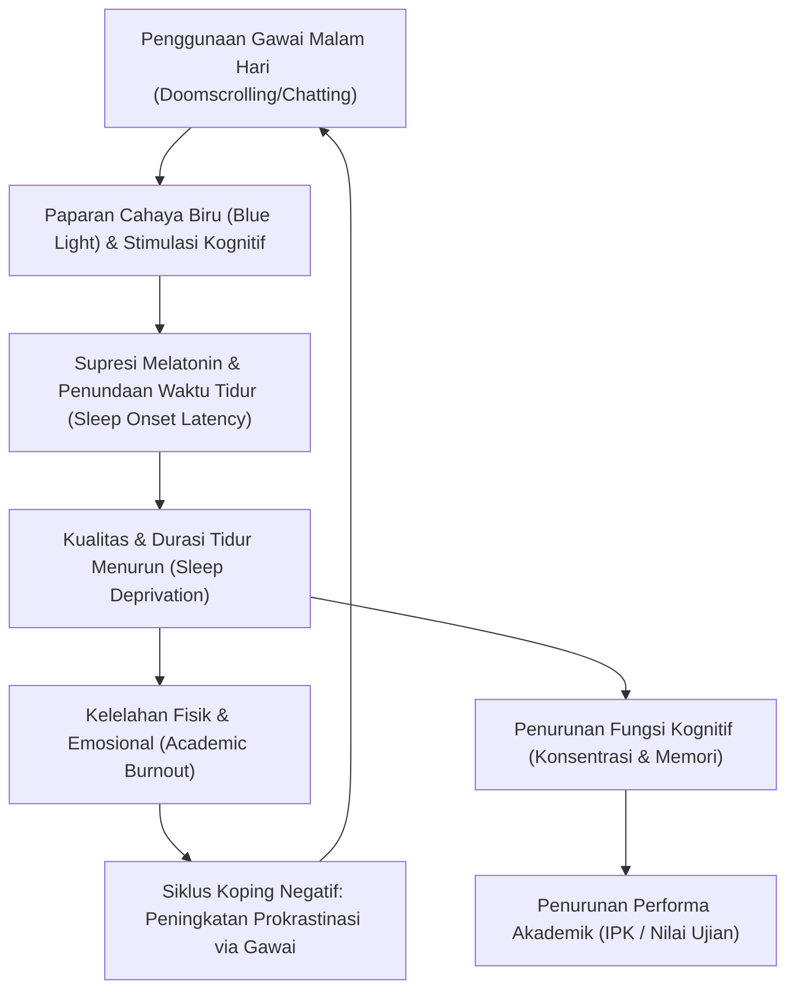

# Catatan Riset & Tinjauan Pustaka: Deteksi Dini Risiko Burnout Akademik dan Gangguan Kesehatan Mental Mahasiswa

Dokumen ini disusun untuk mendukung pengembangan proposal penelitian mengenai penggunaan *passive sensing* pada *smartphone* dan *machine learning* untuk mendeteksi *burnout* akademik dan gangguan kesehatan mental pada mahasiswa.

---

## 1. Fitur *Passive Sensing Smartphone* dan Korelasinya dengan Stres/Burnout

*Digital phenotyping* menggunakan sensor pasif gawai memungkinkan pemantauan perilaku tanpa membebani pengguna (non-intrusif). Berdasarkan literatur, fitur-fitur berikut paling signifikan berkorelasi dengan tingkat stres, kecemasan, dan *burnout*:

*   **Durasi Layar Aktif (*Screen-time Duration*):**
    *   *Korelasi:* Positif (semakin lama durasi, semakin tinggi risiko stres).
    *   *Keterangan:* Penggunaan layar yang ekstrem (>6 jam/hari) sering kali merupakan bentuk koping pelarian (*escapism*) dari tekanan akademik atau tanda adiksi gawai.
*   **Frekuensi Membuka Kunci Layar (*Unlock Frequency*):**
    *   *Korelasi:* Positif dengan kecemasan (*anxiety*).
    *   *Keterangan:* Membuka kunci layar secara impulsif dan berulang-ulang dalam rentang waktu singkat menandakan tingkat kecemasan tinggi, ketidakmampuan berkonsentrasi (rentang perhatian pendek), dan *Fear of Missing Out* (FOMO).
*   **Kategori Aplikasi (Hiburan vs. Produktivitas):**
    *   *Korelasi:* Rasio aplikasi hiburan/media sosial yang tinggi berbanding lurus dengan peningkatan tingkat penundaan tugas (*academic procrastination*) dan kecemasan, sedangkan penggunaan aplikasi produktivitas yang stabil menunjukkan regulasi diri yang baik.
*   **Pola Waktu Aktif (*Circadian Rhythm & Mobility*):**
    *   *Korelasi:* Aktivitas gawai di luar jam normal (misalnya antara pukul 00.00 – 04.00) berkorelasi kuat dengan insomnia, kecemasan, dan kelelahan emosional. Keberagaman lokasi (GPS) yang rendah (mahasiswa cenderung hanya di kamar/kos) juga merupakan indikator kuat gejala depresi.

> [!NOTE]
> Perubahan perilaku yang bersifat mendadak (seperti penurunan drastis dalam interaksi sosial/komunikasi telepon dan pergeseran pola tidur) merupakan indikator yang lebih sensitif daripada nilai absolut metrik gawai itu sendiri.

---

## 2. Alur Algoritma *Machine Learning* untuk Klasifikasi *Real-Time*

Untuk membangun sistem deteksi dini (*early-warning system*) yang akurat, alur pemrosesan data adalah sebagai berikut:

```
[ Sensor Pasif Gawai ] ➔ [ Ekstraksi Fitur ] ➔ [ Preprocessing & Scaling ] ➔ [ Handling Imbalance (SMOTE) ] ➔ [ ML Model (RF/SVM) ] ➔ [ Klasifikasi Risiko ]
```

### Pemrosesan Data & Fitur
1.  **Ekstraksi Fitur:** Mengubah data mentah (misal: log timestamp layar kunci) menjadi fitur agregat (misal: rata-rata frekuensi *unlock* per jam, deviasi standar durasi tidur).
2.  **Standardisasi:** SVM sangat sensitif terhadap skala fitur, sehingga membutuhkan standardisasi (*Z-score scaling*) atau normalisasi *min-max*. Random Forest lebih kuat menghadapi data yang tidak diskalakan.
3.  **Mengatasi Ketidakseimbangan Data (*Class Imbalance*):** Kasus stres berat biasanya berjumlah sedikit dalam populasi mahasiswa. Penggunaan teknik seperti **SMOTE** (*Synthetic Minority Over-sampling Technique*) sangat krusial agar model tidak bias terhadap kelas mayoritas (stres rendah).

### Perbandingan Model: *Random Forest* vs. *Support Vector Machine* (SVM)

| Karakteristik | Random Forest (RF) | Support Vector Machine (SVM) |
| :--- | :--- | :--- |
| **Rentang Akurasi** | Rata-rata **87% – 94%** pada data multi-modal. | Rata-rata **85% – 99%** dengan kernel RBF setelah tuning optimal. |
| **Kelebihan** | - Sangat baik dalam menangani fitur non-linear.<br>- Memberikan nilai *feature importance* (dapat mengetahui fitur gawai apa yang paling dominan memicu stres). | - Sangat kuat untuk batasan kelas yang kompleks jika menggunakan kernel RBF.<br>- Efisien pada ruang dimensi tinggi. |
| **Kekurangan** | - Rentan *overfitting* jika pohon keputusan terlalu dalam (*max_depth* tidak dibatasi). | - Memerlukan pra-pemrosesan data yang ketat (skala fitur harus sama).<br>- Lebih sulit diinterpretasikan secara langsung (*black-box*). |
| **Hyperparameter Utama** | `n_estimators`, `max_depth`, `min_samples_split`. | `C` (regulasi), `kernel` (RBF/Linear), `gamma`. |

### Arsitektur Deteksi *Real-Time*
*   **Client Side (Mobile App):** Menggunakan *framework* seperti Flutter atau Android Native (Kotlin/Java) untuk mengumpulkan data sensor secara latar belakang (*background service*) menggunakan pustaka seperti *AWARE Framework*. Data diagregasikan lokal secara periodik (misal: per 1 jam atau per hari) untuk menghemat baterai.
*   **Server Side (REST API):** Data agregat dikirim ke server berbasis Python (Flask/FastAPI) di mana model ML (RF/SVM) yang telah dilatih dijalankan. Server mengembalikan prediksi tingkat risiko (Rendah/Sedang/Tinggi) secara instan ke aplikasi mahasiswa dan dasbor konseling kampus.

---

## 3. Hubungan Pola Penggunaan Malam Hari dengan Kinerja Akademik & *Burnout*

Hubungan sebab-akibat antara penggunaan smartphone di malam hari dengan penurunan akademik dan kelelahan emosional dapat digambarkan dalam rantai kausal berikut:



### Keterkaitan Variabel

*   **Mediasi Kualitas Tidur:** Smartphone bukan penyebab langsung *burnout* akademik, melainkan melalui variabel mediator berupa rusaknya kualitas tidur. Kurang tidur merusak fungsi lobus frontal otak yang mengatur konsentrasi dan memori jangka pendek.
*   **Siklus Prokrastinasi:** Mahasiswa yang cemas akan tugas akademiknya cenderung melarikan diri dengan bermain gawai di malam hari (prokrastinasi), yang kemudian memperpendek waktu tidur mereka, memicu kelelahan esok harinya, menurunkan performa akademik, dan akhirnya berujung pada *emotional exhaustion* (kelelahan emosional).

---

## 4. Sumber Data & *Open Dataset* Relevan

Untuk melatih model ML tanpa harus mengumpulkan data dari nol pada tahap awal riset, Anda dapat memanfaatkan dataset akademis terbuka berikut. 

> [!IMPORTANT]
> **Status Lokal:** **StudentLife Dataset (Dartmouth College)** telah berhasil diunduh dan diekstraksi ke direktori lokal Anda:
> *   **Format RDS (R/Python):** `dataset_studentlife/dataset_rds/` (Gunakan kode contoh di [read_data_example.py](file:///c:/Users/Faiz/Documents/Semester%206/APTEK/read_data_example.py) untuk memuat data ini menggunakan **Python (pyreadr)** atau **R (readRDS)**).
> *   **Format Excel (XLSX):** `dataset_studentlife_excel/` (Tersedia file `surveys.xlsx`, `ema_responses.xlsx`, serta data sensor `sensing_phonelock.xlsx`, `sensing_dark.xlsx`, `sensing_conversation.xlsx`, dll. untuk langsung dibuka di Microsoft Excel).

1.  **StudentLife Dataset (Dartmouth College) [TERSEDIA LOKAL]:**
    *   *Deskripsi:* Dataset terlengkap untuk pelacakan mahasiswa menggunakan sensor *passive sensing* Android selama 10 minggu kuliah (48 mahasiswa).
    *   *Fitur yang Tersedia:* Log tidur pasif (`dark.Rds`), aktivitas fisik (`activity.Rds`), durasi percakapan (`conversation.Rds`), lokasi GPS (`gps.Rds`), sensor layar (`phonelock.Rds`), survei stres harian (`EMA/Stress.Rds`), kuesioner depresi (`survey/PHQ-9.Rds`), dan data akademik (GPA).
    *   *Tautan Resmi:* [StudentLife Website](https://studentlife.cs.dartmouth.edu/)
2.  **NetHealth Dataset (University of Notre Dame):**
    *   *Deskripsi:* Dataset longitudinal berskala besar yang melacak kesehatan dan interaksi sosial mahasiswa menggunakan ponsel pintar dan jam pintar (Fitbit).
    *   *Fitur yang Tersedia:* Data panggilan/SMS pasif, data tidur Fitbit, aktivitas fisik harian, jaringan pertemanan sosial, IPK, dan survei kesehatan mental berkala.
    *   *Tautan Resmi:* [NetHealth Notre Dame](https://nd.edu)
3.  **AWARE Framework (Pustaka Pengumpul Data):**
    *   *Deskripsi:* Jika ingin membangun dataset lokal di Indonesia, AWARE adalah *middleware* open-source untuk iOS dan Android yang dapat diintegrasikan guna merekam data sensor gawai secara pasif.
    *   *Tautan:* [AWARE Framework](https://awareframework.com/)

---

## 5. Referensi Jurnal Utama & Landasan Pustaka

Berikut adalah daftar referensi jurnal ilmiah berkualitas tinggi yang relevan untuk memperkuat proposal PKM AI atau penelitian Anda:

### Referensi Jurnal Global
1.  **Wang, R., Chen, F., Chen, Z., Li, T., Harari, G., Tignor, S., ... & Campbell, A. T. (2014).**
    *   *Judul:* "StudentLife: assessing mental health, cognitive algorithms and academic performance of college students using smartphones."
    *   *Jurnal:* *Proceedings of the 2014 ACM International Joint Conference on Pervasive and Ubiquitous Computing* (UbiComp '14).
    *   *Poin Penting:* Jurnal pionir yang merilis dataset StudentLife dan membuktikan korelasi kuat antara durasi tidur otomatis dengan performa IPK mahasiswa.
2.  **Adler, D. A., Wang, F., Mohr, D. C., & Choudhury, T. (2022).**
    *   *Judul:* "Machine learning for passive mental health symptom prediction: Generalization across different longitudinal mobile sensing studies."
    *   *Jurnal:* *PLOS ONE*, 17(4), e0254060.
    *   *Tautan:* [PLOS ONE Article](https://journals.plos.org/plosone/article?id=10.1371/journal.pone.0254060)
    *   *Poin Penting:* Membahas generalisasi algoritma ML (seperti Gradient Boosting Trees) lintas dataset (StudentLife & CrossCheck) untuk memprediksi gejala stres dan kualitas tidur.
3.  **Frontiers in Psychiatry (2021).**
    *   *Judul:* "Predicting Symptoms of Depression and Anxiety Using Smartphone and Wearable Data."
    *   *Jurnal:* *Frontiers in Psychiatry*.
    *   *Tautan:* [Frontiers in Psychiatry Article](https://www.frontiersin.org/articles/10.3389/fpsyt.2021.648130/full)
    *   *Poin Penting:* Studi komprehensif mengenai ekstraksi fitur fisiologis dan penggunaan gawai untuk mendeteksi depresi dan kecemasan secara longitudinal.

### Referensi Jurnal Lokal Indonesia
1.  **Analisis Hubungan Durasi Penggunaan Gadget dengan Stres Mahasiswa:**
    *   *Poin Penelitian:* Penelitian-penelitian *cross-sectional* di berbagai fakultas kedokteran dan psikologi Indonesia (dapat dicari di Google Scholar dengan kata kunci `"durasi penggunaan gadget" stres mahasiswa jurnal`) secara konsisten membuktikan adanya hubungan signifikan ($p < 0.05$) antara tingginya durasi gawai dengan kejadian stres akademik.
2.  **Klasifikasi Tingkat Stres Menggunakan Algoritma Machine Learning di Indonesia:**
    *   *Poin Penelitian:* Implementasi algoritma klasifikasi (SVM, Naive Bayes, Decision Tree) untuk mengklasifikasikan stres mahasiswa berdasarkan kuesioner DASS-42 atau PSS-10 yang diintegrasikan ke platform web/Android. Beberapa studi mencatat akurasi SVM mencapai lebih dari 85% untuk data multi-fitur kesehatan mahasiswa.
